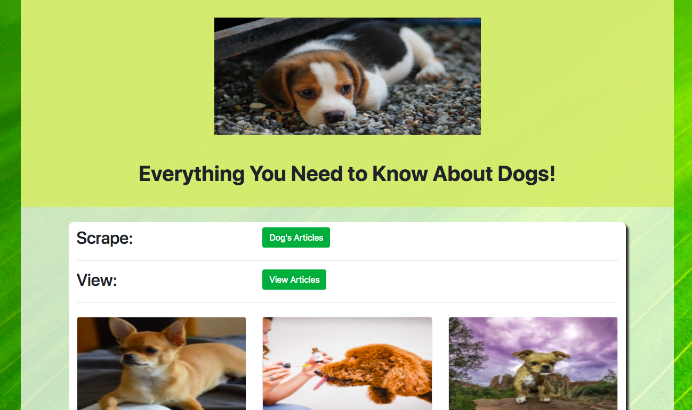
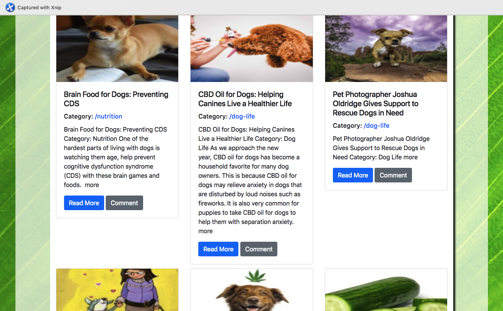
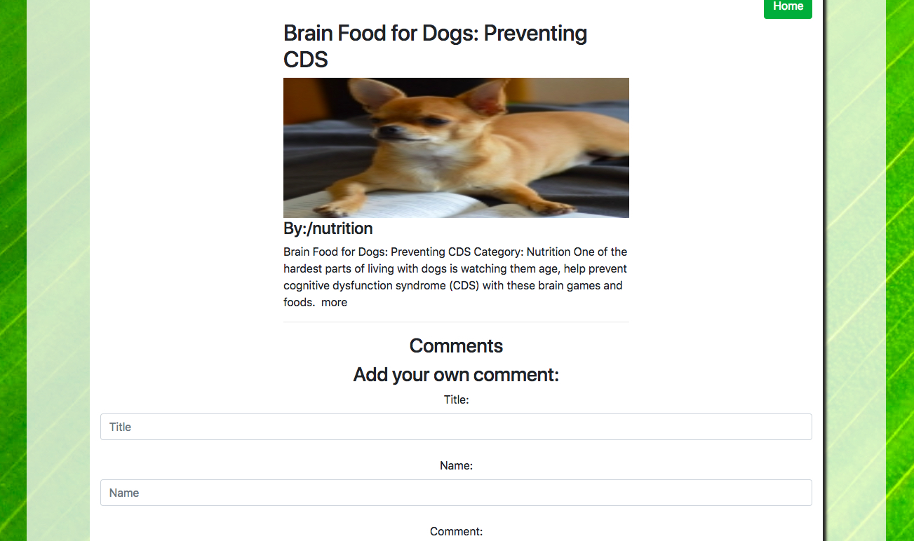

# Dog Articles Scraper

## What is it? 
Dog Articles Scraper is an application that allows its users to scrape for the latest dog's articles from a dog website:https://moderndogmagazine.com/articles
Users can then comment on articles of interest and save them. 

***

## User Interaction
When the user enters the page they are led to a page where they can choose to scrape for new articles from modern dog magazine. 

They can open a link to view the original article and read it. 

The user can then click the comment button and leave a comment about what they thought about the article. 

## What technologies are used? 
The technologies used in this News Scraper include: 

* HTML
* CSS
* JavaScript
* Handlebars
* Node (primarily the cheerio and axios packages)
* MongoDB
* Express

***

## How to Initialize the Dog Scraper on your own machine
1. Git clone the repository
2. Navigate to the repository in terminal or bash
3. Type npm i
4. Type node server (or nodemon server)

***
## Future Development
1. Adding a user database and authentication process so that users can save articles to their account

***
## See the App in Action
[See the App in Action](https://ancient-crag-53575.herokuapp.com/)
